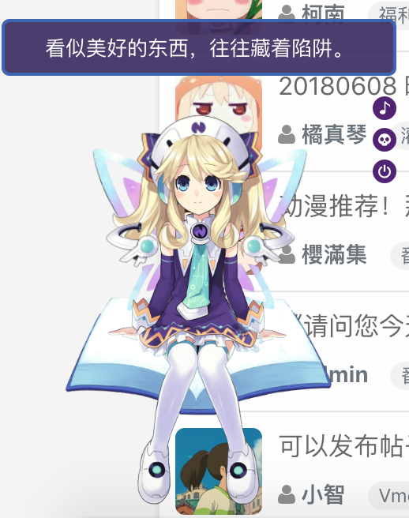

<h1 align="center">Vmoex - 期望成为最美好的二次元社区</h1>
<p align="center">
    <a href="LICENSE" target="_blank">
        
    </a>
</p>

<p align="center">
vmoex是一个开源的二次元社区程序，同时也是一个多用户多角色的内容管理系统。
</p>

首页：


管理后台：


移动端：


个人中心：


## 安装
```
mkdir vmoex-framework
```
```
cd vmoex-framework
```
### 启动容器
```
docker run -d -p 3110:3110 -p 3120:3120 -p 3121:3121 --name vmoex  -v $(pwd):/var/www zhonghaibin/vmoex-framework
```
3110是web端口，3120是websocket端口
### 进入容器
```
docker exec -it vmoex   bash
```
### 填写数据库和reids等等配置信息
```
vi /var/www/app/config/parameters.yml
```
### 导入数据库
```
php bin/console doctrine:database:init
```
### 载入翻译数据
```
php bin/console translation:persist
```
### 修改管理员密码
```
 php bin/console doctrine:schema:update --force 
```
```
 php bin/console change-password -u admin -p [password]
```
### 清理缓存
```
 php bin/console cache:clear --env=prod
```
### 创建静态资源文件
```
 php bin/console assetic:dump --env=prod
```
## 现在请通过 http://127.0.0.1:3110 进行访问

### 重启websocket
```
 php bin/push-service.php restart -d
```
### 其他命令
```angular2html
php bin/console doctrine:cache:clear-metadata
```
```angular2html
php bin/console doctrine:cache:clear-metadata
```
```angular2html
php bin/console doctrine:cache:clear-result
```

## 功能

- GitHub登录 ✅
- 邮箱验证、用户信息编辑功能 ✅
- 多国语言支持 ✅
- 丰富的后台管理功能 ✅
- 用户发帖、回复（支持@其他人） ✅
- 站内即时聊天、无刷新获取通知 ✅
- 支持Markdown ✅
- 会员主页、关注他人、发送私信给他人 ✅
- 自动为新用户随机生成动漫头像 ✅

## 使用的第三方库

### 前端

- JQuery
- Bootstrap / Bootstrap-social
- JQuery-pjax
- sb-admin2 （管理端）
- NProgress
- socket.io (socketio client side)
- wangEditor
- at.js

### 后端

- Symfony3.4
- workerman/phpsocket.io (socketio server side)
- snc/redis-bundle
- guzzlehttp/guzzle
- knplabs/knp-markdown-bundle (markdown support)
- intervention/image (图片处理)
- yzalis/identicon （头像生成）

> 😘 感谢第三方插件和框架~

## 看板娘



由[维基萌](https://www.wikimoe.com/)提供(😘)。

## 帮助与反馈

首先欢迎使用此程序搭建自己的二次元社区，在安装和使用中，遇到任何问题，请在本仓库的提交issue；如果你有搭建成功，欢迎在issues页提交自己的域名，
我会考虑将你的域名和网站名称放在此介绍页。
